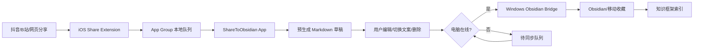

# 架构设计

## 为什么取消旧方案

旧方案依赖定时打开抖音收藏页、滚动读取、下载视频、转写，再写入 Obsidian。缺陷：

- 不实时；
- 页面懒加载和登录状态不稳定；
- 平台反爬会影响成功率；
- 只能覆盖抖音收藏夹；
- 用户无法在入库前修改笔记质量。

## 新方案

新方案以“分享动作为入口”：

## 模块职责

- Share Extension：接收外部分享链接，尽快入队，不做重处理。
- iOS App：展示队列、编辑草稿、删除、手动同步。
- MarkdownGenerator：生成 Obsidian 初稿和多个版本。
- SyncEngine：向电脑桥接器同步，失败则保留队列。
- Windows Bridge：接收 JSON，补充可获取的网页/视频元数据，写入 Obsidian，并更新知识框架、平台、标签索引。

## 同步策略

优先级：

1. 局域网实时同步：App POST 到 `http://电脑IP:8765/captures`。
2. 离线队列：电脑不在线时，App 保留 `queued` 状态。
3. 开机补同步：电脑桥接器开机启动后，App 下次打开或用户点同步即可补发。

后续可增强：

- iCloud Drive 队列目录；
- CloudKit 私有数据库；
- Tailscale/ZeroTier 内网穿透；
- 本地 LLM/Claude/Codex 读取 `移动收藏` 文件夹生成长期知识框架。
